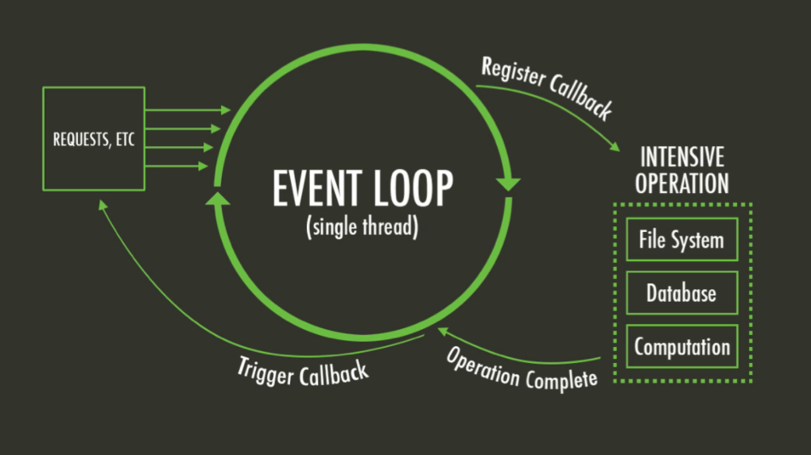
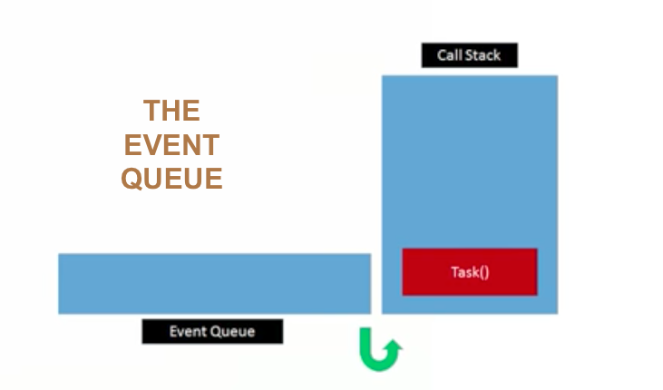
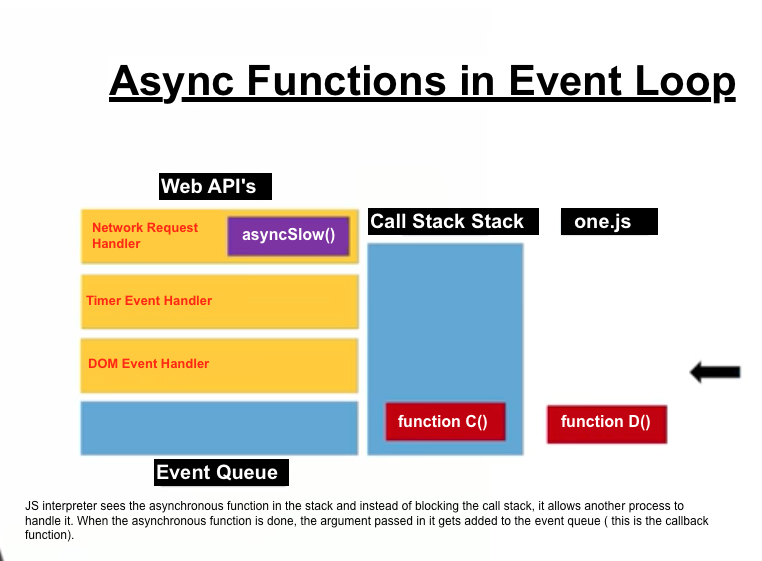

## Asynchronous functions

asynchronous programming keeps web applications responsive by allowing multiple tasks to be processed at the same time.

<kbd>the Event Loop</kbd>

- The javascript runtime executes code in a single thread, meaning it can only run one statement at a time.
- Code is usually placed on the call stack before being executed
- The call stack is a segment of memory that keeps the browser queues up tasks
- The event loop, is the process in which the browser queues up tasks
- All code is run til completion by order of execution in call stack
- The event queu is initially empty, as events occur, event handlers place new tasks onto the event queue.
-     some examples ofthese events are mouse clicks, keyboard presses and timed events.
- Tasks wait on the event queue til the call stack is empty.
- Once empty, the first task in the queue is put on the stack.
- The subsequent tasks wait until the call stack is empty again and the cycle repeats.
- THIS CYCLE IS THE EVENT LOOP   

 
<kbd>the event queue</kbd>

## How asynchronous functionsfit into the event loop?
- when js runtime comes across an asynchronous function in the call stack, it does not process it immediately.
- instead of blocking the call stack until it is finished, it allows another process to handle processing of the asynchronous function
- When the other process has finished, it adds a task back on to the event queue.
- This task is usually a CALLBACK function, passed in as one of the arguments, to the original asynchronous function.

## But isn't Javascript single threaded?
- The runtime is single threaded, but there are other processes running in a browser, such as timers, input handlers and Network request APIs that run in parallel with the event loop, by putting new tasks on to the event queue.

<kbd>async functions in the event loop</kbd>     

## why are async functions important?
- They are important because some tasks, such as network request are slow, and so it allows for slow tasks to be operated on a separate thread to stop a task from blocking the browser.
- Callbacks are used to specify what new tasks are sent back to the event queue once the other process has finished processing.
... and that is the story of the Event Loop 

:100:
